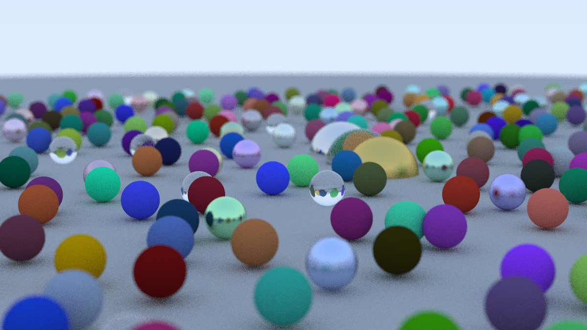

# Ray Tracing in One Weekend
This repository contains my own implementation of [Ray Tracing in One Weekend](https://raytracing.github.io/) by Peter Shirley, Trevor David Black and Steve Hollasch, following the first book.

Building the project via:
```
cmake -B ../build/
```
then rendering the image via:
```
../build/RayTracing1Wknd > ../image.ppm
```
will produce the following image:


